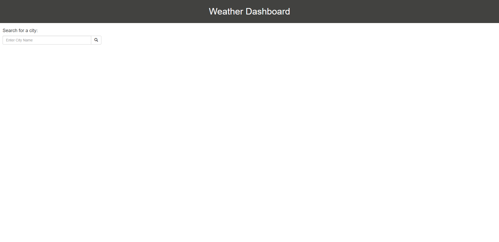
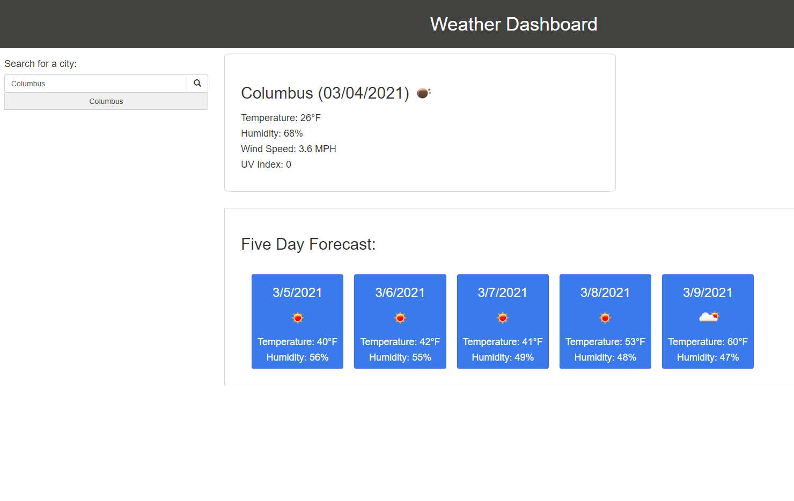
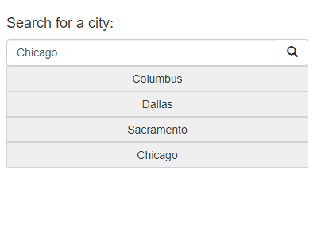

# Weather Dashboard

<a href="https://mephestomd.github.io/day-scheduler/">Day Scheduler</a>

*An interactive weather forecast app with current and five-day functionality*

## Goal

To create an app which will allow the user to enter a city name and be presented with two separate blocks of information: a card displaying the current weather and a set of five cards displaying the five-day forecast.

## Purpose

To the give the user a simple and easy-to-use interface to quickly check current and future weather conditions.

## Method

JQuery DOM manipulation was used to display information on-screen with API fetch() calls used to grab up-to-date weather information from the openweathermap.org API. 

## Usage

The following will give examples and screenshots of how a user can interact with the weather app:

Upon loading the page, the user will be presented with the following page displaying a search bar:

The following image displays what a user sees after entering the city 'Columbus' and hitting 'Enter' or clicking the search icon:

The following image is a close-up of the history bar, which grows in size as the user continues to add search query terms. These history terms can then be clicked to quickly display weather information for a previously-searched city:

## Credits

<ul>
<li>
Valerie Flores - Mentor and tutor || <a href="https://github.com/valeriemiller5">Github</a>
</li>

<li>
Guillermo Barila - TA || <a href="https://github.com/gui365">Github</a>
</li>

<li>
Samuel Maddox - TA || <a href="https://github.com/SamuelMaddox">Github</a>
</li>

<li>
OpenWeatherMap API - Current Weather || <a href="https://openweathermap.org/current">OpenWeatherMap Current Weather API</a>
</li>

<li>
OpenWeatherMap API - Five-Day Forecast || <a href="https://openweathermap.org/forecast5">OpenWeatherMap Five-Day Forecast Weather API</a>
</li>

<li>
w3schools.com CSS Grid || <a href="https://www.w3schools.com/css/css_grid.asp">w3schools - CSS Grid</a>
</li>   
</ul>

## License

MIT License

Copyright (c) 2021 Maxson Green

Permission is hereby granted, free of charge, to any person obtaining a copy
of this software and associated documentation files (the "Software"), to deal
in the Software without restriction, including without limitation the rights
to use, copy, modify, merge, publish, distribute, sublicense, and/or sell
copies of the Software, and to permit persons to whom the Software is
furnished to do so, subject to the following conditions:

The above copyright notice and this permission notice shall be included in all
copies or substantial portions of the Software.

THE SOFTWARE IS PROVIDED "AS IS", WITHOUT WARRANTY OF ANY KIND, EXPRESS OR
IMPLIED, INCLUDING BUT NOT LIMITED TO THE WARRANTIES OF MERCHANTABILITY,
FITNESS FOR A PARTICULAR PURPOSE AND NONINFRINGEMENT. IN NO EVENT SHALL THE
AUTHORS OR COPYRIGHT HOLDERS BE LIABLE FOR ANY CLAIM, DAMAGES OR OTHER
LIABILITY, WHETHER IN AN ACTION OF CONTRACT, TORT OR OTHERWISE, ARISING FROM,
OUT OF OR IN CONNECTION WITH THE SOFTWARE OR THE USE OR OTHER DEALINGS IN THE
SOFTWARE.